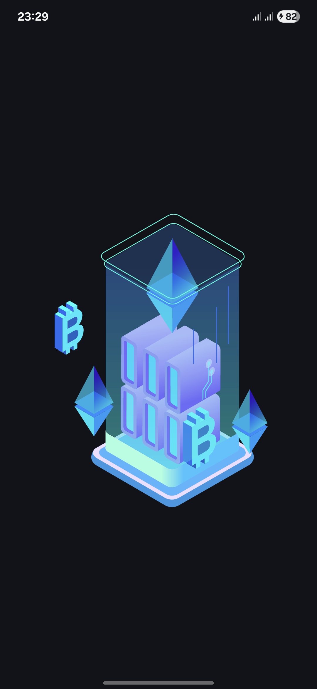
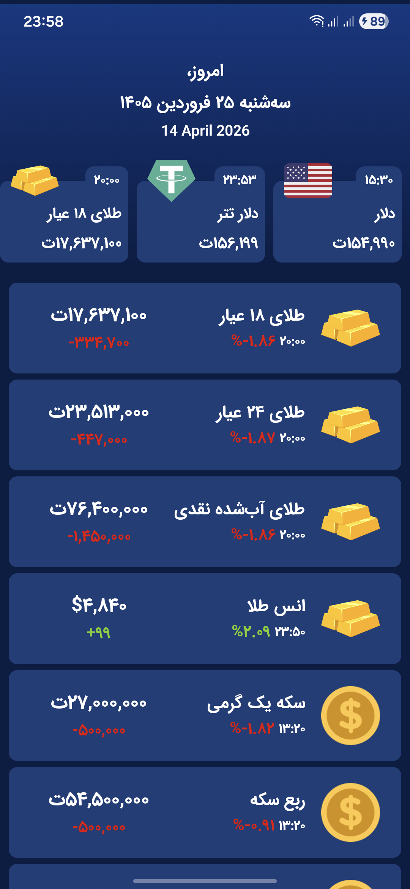

# Coinollar

A modern Android application for real-time tracking of **cryptocurrency**, **fiat currency**, and **gold** prices — built with **Jetpack Compose**, **Clean Architecture**, and **multi-module** structure.

<p align="center">
  
</p>

<p align="center">
  <a href="https://github.com/farid-moghadam-dev/Coinollar/actions"></a>
  
  
  
</p>

---

## Features

- **Live Price Tracking** — Real-time prices for 19+ cryptocurrencies, 27+ fiat currencies, and gold/coin variants
- **Offline Support** — Room database caching with automatic fallback when offline
- **Pull-to-Refresh** — Material 3 swipe-to-refresh for latest data
- **Shimmer Loading** — Skeleton loading animation for smooth UX
- **Detail Screen** — Tap any currency to see detailed price information
- **Persian (Jalali) Calendar** — Displays both Jalali and Gregorian dates
- **RTL Layout** — Full right-to-left support for Persian/Arabic users
- **Price Change Indicators** — Color-coded percentage changes with formatted values
- **Animated Splash Screen** — Smooth Lottie animation on app launch
- **Dark Theme UI** — Elegant dark blue gradient design with Material 3
- **Dynamic Colors** — Supports Android 12+ Material You dynamic theming

## Screenshots

<!-- Add your screenshots here -->
<!--    -->

## Architecture

The project follows **Clean Architecture** with a **multi-module** structure for clear separation of concerns, faster build times, and better scalability.

```
Coinollar/
├── app/                          # Application entry point, navigation
│   ├── CoinollarApp.kt           # @HiltAndroidApp
│   ├── MainActivity.kt           # Single Activity with NavHost
│   └── navigation/               # Compose Navigation routes
├── core/
│   ├── common/                   # Shared Result type, utilities
│   ├── network/                  # Ktor HTTP client setup
│   ├── database/                 # Room database, DAOs, entities
│   └── designsystem/             # Theme, typography, shared components
├── data/                         # Repository implementations, mappers
├── domain/                       # Models, repository interfaces, use cases
└── feature/
    ├── home/                     # Home screen with currency list
    ├── detail/                   # Currency detail screen
    └── splash/                   # Splash screen with Lottie
```

### Module Dependency Graph

```
       ┌──────────┐
       │   :app   │
       └────┬─────┘
            │
    ┌───────┼───────────────┐
    │       │               │
    ▼       ▼               ▼
:feature  :feature      :feature
 :home    :detail       :splash
    │       │               │
    └───┬───┘               │
        │                   │
    ┌───▼───┐        ┌──────▼──────┐
    │:domain│        │:core        │
    └───┬───┘        │:designsystem│
        │            └─────────────┘
    ┌───▼──┐
    │:data │
    └──┬───┘
       │
  ┌────┼────┐
  ▼         ▼
:core     :core
:network  :database
  │         │
  └────┬────┘
       ▼
    :core
   :common
```

### Design Patterns

| Pattern | Implementation |
|---------|---------------|
| **Clean Architecture** | Strict layer separation across modules |
| **Multi-Module** | 10 Gradle modules for scalability and build performance |
| **MVVM** | ViewModel + StateFlow for reactive UI |
| **Repository** | Offline-first with network + Room cache |
| **Use Case** | Single-responsibility business logic |
| **Dependency Injection** | Koin for lightweight DI |
| **Sealed Classes** | Type-safe Result and navigation |
| **Single Activity** | Compose Navigation for all screens |

## Tech Stack

| Category | Technology |
|----------|-----------|
| **Language** | Kotlin 2.2 |
| **UI Framework** | Jetpack Compose + Material 3 |
| **Architecture** | Clean Architecture + MVVM |
| **Dependency Injection** | Koin |
| **Networking** | Ktor Client |
| **Local Database** | Room |
| **Serialization** | Kotlin Serialization |
| **Navigation** | Compose Navigation |
| **Image Loading** | Coil 3 |
| **Animations** | Lottie Compose |
| **Logging** | Timber |
| **Calendar** | PersianDate (Jalali) |
| **Testing** | JUnit + MockK + Coroutines Test |
| **CI/CD** | GitHub Actions |
| **Build System** | Gradle (Kotlin DSL) with Version Catalog |
| **Min SDK** | 24 (Android 7.0) |
| **Target SDK** | 36 |

## Getting Started

### Prerequisites

- Android Studio Ladybug or later
- JDK 17+
- Android SDK 36

### Build & Run

```bash
# Clone the repository
git clone https://github.com/farid-moghadam-dev/Coinollar.git

# Open in Android Studio and sync Gradle
# Or build from command line:
./gradlew assembleDebug

# Run tests:
./gradlew test
```

### API Configuration

The app uses [BrsApi](https://brsapi.ir) for market data. Grab a free API key from their website, then add it to your `local.properties` file (this file is gitignored — **never commit your key**):

```properties
API_KEY=your_api_key_here
```

The key is injected into `BuildConfig` at build time by `core/network/build.gradle.kts`:

```kotlin
val apiKey: String = localProperties.getProperty("API_KEY") ?: ""
buildConfigField("String", "API_KEY", "\"$apiKey\"")
```

## Testing

The project includes unit tests across multiple modules:

```bash
./gradlew test                    # Run all unit tests
./gradlew :domain:test            # Run domain layer tests
./gradlew :data:test              # Run data layer tests
./gradlew :feature:home:test      # Run feature tests
```

| Module | Tests |
|--------|-------|
| `:domain` | UseCase tests (FetchCurrencies, GetCurrencyDetail) |
| `:data` | Repository tests (network + cache fallback), Mapper tests |
| `:feature:home` | ViewModel tests (loading, success, error, refresh) |

## Supported Assets

<details>
<summary><strong>Cryptocurrencies (19)</strong></summary>

Bitcoin (BTC), Ethereum (ETH), Tether (USDT), XRP, BNB, Solana (SOL), USD Coin (USDC), TRON (TRX), Dogecoin (DOGE), Cardano (ADA), Chainlink (LINK), Stellar (XLM), Avalanche (AVAX), Shiba Inu (SHIB), Litecoin (LTC), Polkadot (DOT), Uniswap (UNI), Cosmos (ATOM), Filecoin (FIL)

</details>

<details>
<summary><strong>Fiat Currencies (27+)</strong></summary>

USD, EUR, AED, GBP, JPY, KWD, AUD, CAD, CNY, TRY, SAR, CHF, INR, PKR, IQD, SYP, SEK, QAR, OMR, BHD, AFN, MYR, THB, RUB, AZN, AMD, GEL

</details>

<details>
<summary><strong>Gold & Coins</strong></summary>

- 18K Gold, 24K Gold, Melted Gold, Gold Ounce (XAU/USD)
- Emami Coin, Bahar Azadi Coin, Half Coin, Quarter Coin, 1g Coin

</details>

## License

```
MIT License

Copyright (c) 2025 Farid Moghaddam

Permission is hereby granted, free of charge, to any person obtaining a copy
of this software and associated documentation files (the "Software"), to deal
in the Software without restriction, including without limitation the rights
to use, copy, modify, merge, publish, distribute, sublicense, and/or sell
copies of the Software, and to permit persons to whom the Software is
furnished to do so, subject to the following conditions:

The above copyright notice and this permission notice shall be included in all
copies or substantial portions of the Software.

THE SOFTWARE IS PROVIDED "AS IS", WITHOUT WARRANTY OF ANY KIND, EXPRESS OR
IMPLIED, INCLUDING BUT NOT LIMITED TO THE WARRANTIES OF MERCHANTABILITY,
FITNESS FOR A PARTICULAR PURPOSE AND NONINFRINGEMENT.
```

---

*Built with Kotlin and Jetpack Compose*
